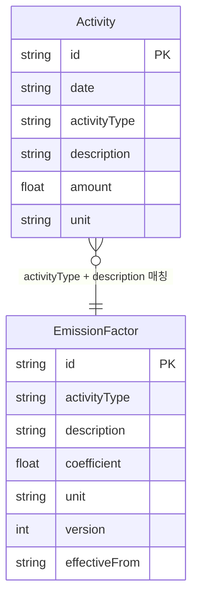

# PCF Dashboard

탄소 배출(PCF) 전과정 데이터를 시각화하는 인터랙티브 대시보드입니다.

---

## 실행 방법

```bash
# 1. 저장소 클론
git clone https://github.com/msms804/PCF-dashboard.git

# 2. 디렉토리 이동
cd PCF-dashboard

# 3. 의존성 설치
npm install

# 4. 개발 서버 실행
npm run dev

# 5. 브라우저에서 확인
# http://localhost:3000
```

---

## 가정 및 질문

- CT-045 데이터는 단일 제품 기준으로 가정했습니다.
- 제공된 데이터에 Scope 1(직접 배출) 항목이 없어 전기(Scope 2), 원소재·운송(Scope 3)만 분류했습니다.
  - Scope 2: 구매한 전기 사용으로 발생하는 간접 배출
  - Scope 3: 원재료 조달, 물류 등 공급망에서 발생하는 배출
- 배출계수는 규제 변경에 따라 업데이트될 수 있으므로 `version`, `effectiveFrom` 필드로 이력 추적이 가능하도록 설계했습니다.
- PostgreSQL은 Optional로 명시되어 있어, DB 연결 없이 동작하는 fake stub으로 구현하고 인터페이스만 완성했습니다. Prisma로 교체 시 `lib/api.ts` 내부만 수정하면 됩니다.

---

## ERD



> 배출계수는 `version`과 `effectiveFrom`으로 이력을 추적합니다.

---

## 아키텍처 개요

```
app/
├── page.tsx                  # 대시보드 (Server Component)
├── activities/page.tsx       # 활동 데이터 (Server Component)
├── emission-factors/page.tsx # 배출계수 (Server Component)
└── api/
    ├── activities/route.ts
    ├── emission-factors/route.ts
    ├── dashboard/kpi/route.ts
    └── import/excel/route.ts

lib/
├── api.ts       # 데이터 레이어 (fake stub → Prisma 교체 가능)
├── types.ts     # 도메인 타입 정의
└── data/seed.ts # CT-045 원본 시드 데이터

components/
├── Sidebar.tsx
├── KpiCard.tsx
├── ActivityTable.tsx
├── ActivityForm.tsx
├── Toast.tsx
└── charts/
    ├── TrendChart.tsx
    ├── TypeChart.tsx
    └── ScopeChart.tsx
```

**데이터 흐름**
```
lib/api.ts (fake stub)
    ↓
app/api/* (API Route)
    ↓
Server Component (fetch)
    ↓
Client Component (차트, 폼, 테이블)
```

---

## 렌더링 설계

| 컴포넌트 | 타입 | 이유 |
|---|---|---|
| 페이지 (`page.tsx`) | Server Component | 데이터 fetch, 초기 로딩 최적화 |
| 차트 (`TrendChart` 등) | Client Component | Recharts가 브라우저 API 필요 |
| `ActivityForm` | Client Component | 폼 상태, 이벤트 핸들러 필요 |
| `ActivityTable` | Client Component | 페이지네이션 상태 필요 |
| `KpiCard` | Server Component | 순수 표시용 |
| `Sidebar` | Client Component | `usePathname` 필요 |

- `loading.tsx` — Next.js Suspense 기반 Skeleton UI 자동 적용
- `error.tsx` — fetch 실패 시 에러 바운더리, 다시 시도 버튼 제공
- `router.refresh()` — 데이터 추가 후 서버 컴포넌트 재실행으로 최신 데이터 반영

---

## Trade-off

**1. Next.js서버에서 PCF 계산**
- 서버(API)에서 계산하도록 설계했습니다.
- 배출계수가 변경되더라도 항상 최신 계수로 계산되고, 클라이언트 번들이 가벼워집니다.

**2. 페이지네이션: 클라이언트 vs 서버**
- 현재 데이터 규모(30개)에서는 클라이언트 페이지네이션으로 충분하다고 판단하였습니다.
- 데이터가 많아지면 API에 `page`, `limit` 파라미터를 추가해 서버 페이지네이션으로 전환할 수 있습니다.

---

## 디자인 결정

**색상**
- 메인 컬러를 초록색(`green-600`)으로 선택했습니다. 탄소 감축·친환경 브랜드 이미지에 맞습니다.
- Scope 2는 파랑, Scope 3는 노랑으로 구분해 차트에서 직관적으로 식별할 수 있게 했습니다.

**KPI 카드**
- 대상 사용자(경영자, 실무자)가 대시보드 진입 시 가장 먼저 알고 싶은 정보(총 배출량, 전월 대비, 최대 배출원)를 상단에 배치했습니다.

**사이드바 고정**
- `sticky`로 스크롤 시에도 네비게이션이 항상 보이도록 했습니다.

**Excel 임포트 위치**
- 별도 페이지 대신 활동 데이터 페이지 내 버튼으로 배치했습니다.

---

## AI 사용 내역

Claude Code를 활용해 개발했습니다.

- 반복적인 보일러플레이트 코드 작성 (Tailwind 클래스, 컴포넌트 구조)
- 라이브러리 API 레퍼런스 확인 (Recharts, xlsx)

설계 방향, 도메인 판단, 컴포넌트 구조, 코드 검토는 직접 수행했습니다.

---

## 작업 소요 시간

| 항목 | 시간 |
|---|---|
| 기획 및 설계 | 약 2시간 |
| Day 1 — 핵심 기능 구현 | 약 6시간 |
| Day 2 — 가산점 기능 및 고도화 | 약 6시간 |
| Day 3 — 문서화 및 제출 준비 | 약 3시간 |
| **합계** | **약 17시간** |

가장 시간이 많이 소요된 부분은 **PCF 집계 로직 설계**입니다.

- **GHG Scope 분류**: 전기는 Scope 2, 원소재·운송은 Scope 3로 분류하는 국제 기준(GHG Protocol)을 먼저 이해해야 했습니다. 제공된 데이터에 Scope 1 항목이 없어 Scope 2/3만 표시하기로 가정했습니다.
- **배출계수 버전 관리**: 배출계수가 변경될 경우 과거 계산값을 고정할지, 최신 계수로 재계산할지 결정이 필요했습니다. 현재는 항상 최신 계수로 계산하되, `version`과 `effectiveFrom`으로 이력을 추적할 수 있도록 설계했습니다.
